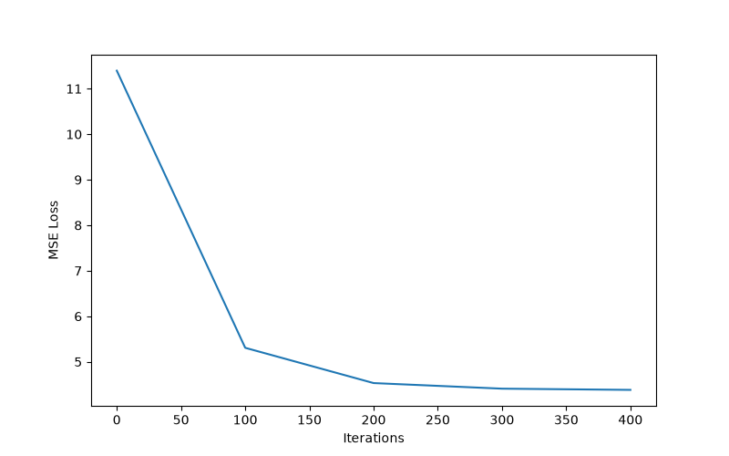
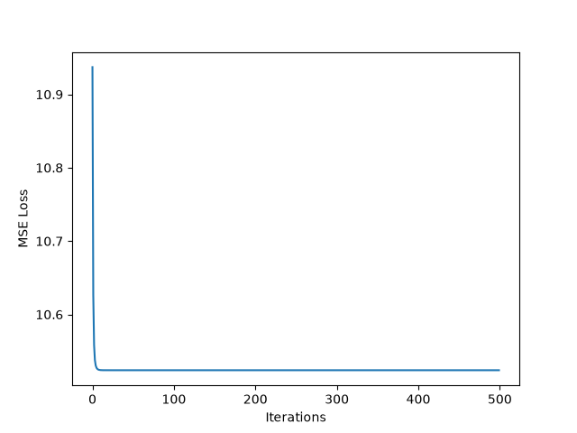
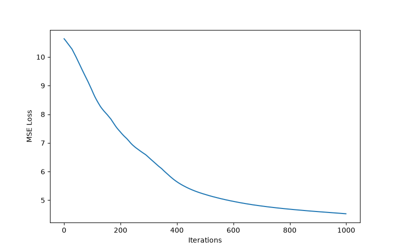
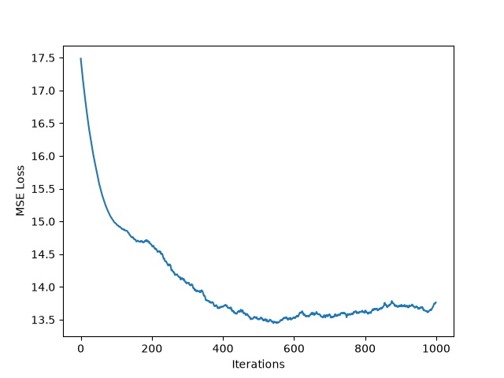

Last Monday, I took my last final exam of this summer semester and finished CSC311, Introduction to Machine Learning!

On my way home, I was thinking about what I actually learned and how I felt about ML throughout this summer. I was really excited
in the beginning of the term to learn about ML, but as the summer dragged on I felt increasingly frustrated with the amount
of mathematical proofs (I hate linear algebra!!!) and generally bored with theory entirely.

It wasn't until I started studying for my final and looking through all of the content from a bird's-eye view, that I felt that ML was pretty interesting. And when I finished my final exam, I really wanted to do more with ML.

Last year, I made a digit recognizer web-app (check it out on my projects page!) that accepted user-drawn digits and passed the input into a neural network I trained. Now, I wanted to start fresh and do something more different. 

I wanted to make my own machine learning framework with only NumPy, with the end-goal being making my own neural net.

## easy start

I started off with a simple linear regression framework. Most linear regression models out there use SVD (singular value decomposition) or some closed form solution to come up with the optimal weights. The one I learned in class was:

$$
w=(X^TX + \lambda I)^{-1}X^Tt
$$

I decided against this since this is $O(n^3)$, I wanted to write gradient descent from scratch using many of the "linear-algebra" shortcuts I had memorized in my mind, and so that I can control the number of training iterations and see how loss evolves over time.

Now, the user can define a linear regression model with their desired l2 rate, learning rate, number of iterations, and whether
they wanted to see training updates every 100 iterations using verbose!

```python
lin_reg = LinearRegression(learning_rate=0.01, 
                           learning_rate=0.01, 
                           epochs=1000, 
                           l2_regularizer_rate=0, 
                           verbose=True)
lin_reg.fit(X_train, y_train)
lin_reg.predict(X_test)
```

## mlp: my little... perceptrons?
After linear regression, I started to brainstorm what kind of neural networks I wanted to model. One of the models we studied
in CSC311 was a MLP (Multi-Layer Perceptron), which is a type of FFN (Feed-Forward Network). 

This was the easiest model to approach compared to models such as CNNs and RNNs since outputs flow from front to back without any loops or feedback connections. Furthermore in a MLP, each node in a layer is connected to every node in the next layer, making forward and backward passes easier to represent in code.

I ended up modeling my MLP like this: a **Layer** class containing all the important information needed for performing forward and backward passes, and a **MLPRegression** class that contains all layers and is responsible for training. No **Node** class required! Every node is connected to every node in the next layer, so we can 'represent' nodes as some combination of weights, biases, and activation without needing a separate class to represent it. 

Fun fact: *My model can incorporate different activation functions in each layer but scikit-learn's MLPRegressor cannot!*

```python
class Layer:
    def __init__(self, ...):
        self.weights = ...
        self.biases = ...
        self.activation = ...
        self.z = ...
        self.input = ...
        self.output = ...
        self.weights_gradients = ...
        self.bias_gradients = ...

class MLPRegressor:
    def __init__(self, ...):
        self.layers = ...
        self.learning_rate = ...
        self.epoch = ...
        self.hidden_layer_sizes = ...
        self.activation_functions = ...

        self.inputs = ... 
        self.targets = ...
```

I also implemented my own activation function classes that return their outputs and derivatives. Example:

```python
class ReLU:
    def compute(self, z):
        return np.maximum(0, z)
    def derivative(self, z):
        return (z > 0)
```

## test time!
For both linear regression and MLP models, I am using the 'liver-disorders' dataset from OpenML, using sklearn.datasets.fetch_openml, using standardScaler, and splitting the data into a 80:20 split. 

All models are using the *Mean Squared Error Loss* or its "half version". Lastly, the scikit-learn models are configured to
train as close as possible to how my custom models are being trained: iterating through the entire batch of data (no mini-batch!), no early stopping, or momentum. 

One thing I wanted to comment on for both scikit-learn models was that they were trained using *'partial_fit'*, since I wanted to keep track of the loss over time. This feature, in my knowledge, is for mini-batch training. I ended up passing in the entire *X_train* dataset, so it became batch training :D


Let's start off with linear regression. My params:

```python
learning_rate = 0.01
l2_regularizer_rate = 0.001
epochs = 500
```

This is the custom linear regression model:


This is scikit-learn's SGDRegressor:


For the custom linear regression model, the final loss on the test set was *7.1012*, while scikit-learn's
was *7.1269*. The training times were *1.6330ms* and *6.4759ms* respectively. Relatively equal performance on the test set, however
scikit-learn's model reached a training loss minima significantly faster than my custom model D:


Now, our MLP models! My params:
```python
learning_rate = 0.001
epoch = 1000
hidden_layer_sizes = (10, 5)
activation_funcs = [ReLU(), ReLU()]
```
This is the custom MLP model:


This is scikit-learn's MLPRegressor:


For the custom MLP model, the final loss on the test set was *5.5932*, while MLPRegressor's loss was *7.0745*. The training
times were *56.4182ms* and *189.1702ms* respectively. From the graph it seems like both models also had very similar performance
in terms of loss, however my custom model does seem to be faster! I did not include early stopping for MLPRegressor, so the model performance could have potentially been even better.

# last thoughts

Me 2 months ago would've believed ML to be this super buzzwordy and boring field of work where you throw random models onto datasets to see if they would work. But after getting my hands dirty with actually implementing something from theory, my opinion has really changed.

ML Systems / Deep Learning Systems Engineering seems more enticing to explore. I definitely want to explore recreating old and modern models from scratch, and studying how we can make operations that go into these things so much faster.

This project took way too long and this blog post even longer, but I hope you enjoyed reading it!